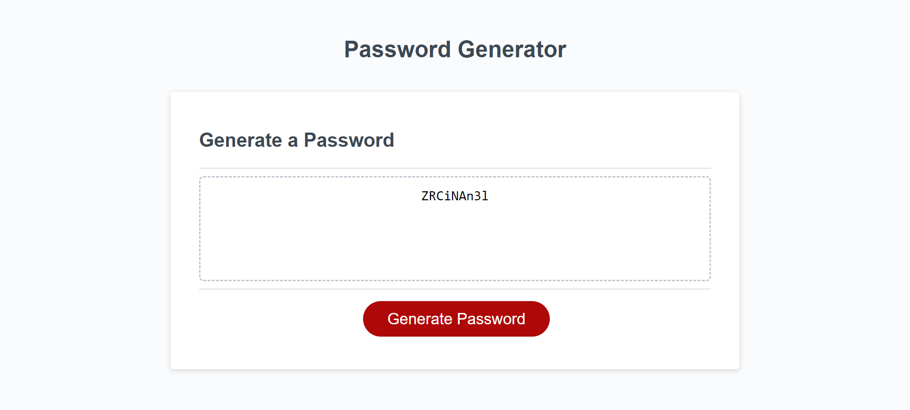

# Password Generator Project
## Description:

For this project, I was instructed to update the javascript in order to enhance existing html and css so that it would populate as a password generator site. My goal is to address the above points, along with proper deployment, and application and repo quality. 

Everething hereafter was done in javascript. To start, I created the function "createPassword" and "checkUserInput." For posterity, "checkUserInput" homes in on direct user input into the "createPassword" pop up boxes, which ask specific questions re password criteria selected by user. The above was based on the conditionals/requirements provided in this week's module. 

Moving beyond this, I then tested the site several times, answering all possible options. During this process it was revealed that a curly bracket was missing on line 12; fixed. Similarly, as I progressed through this phase, I created lines 47-49, just in case the user selects "n" for all related options.  

My primary goals throughout the above processes include: 
When user clicks generate password button, they are presented with a series of prompts for password criteria; when prompted, user can choose which criteria to include in the password (e.g. length of at least 8 characters and no more than 128 characters, lowercase, uppercase, numeric, and/or special characters); when user answers each prompt, input is validated and at one character type should be selected at minimum; once all prompts are answered, a password is generated that matches the selected criteria; once the password is generated, the password is written to the page in it's respective display box. 

Throughout this entire process, I added relevant comments in the javascript; these comments act as snippets of the general outline of the content herein.

### GitHub Link: https://github.com/mslzbry/module-3-passwordgen
### Site Link: https://mslzbry.github.io/module-3-passwordgen/ 

